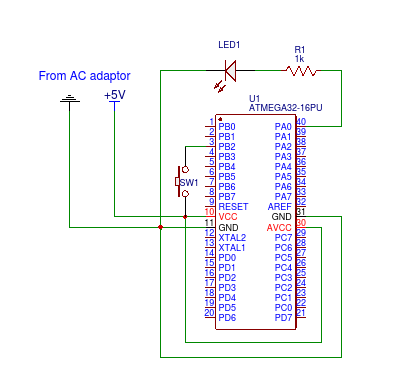

Lesson 2: Inputs and Interrupts
===============================

This lesson covers:
 - How to detect when a GPIO pin is high with while loops
 - How to detect when a GPIO pin is high with interrupts
 - How to add a button that toggles the LEDs state

Detecting Inputs with While Loops
---------------------------------

In the last lesson we covered controlling MCU pins using the General I/O 
Registers DDRx, PORTx and PINx. These were used to drive a potential difference
from PORTA0 ("drive it _high_") and power on an LED.

In this lesson we will connect an input from +5V power source to PORTB2 (a
different port could equally have been chosen - the reason PORTB2 specifically
was used will be revealed later). This will be controlled by a button. When the
button is held down, current will flow to PORTB2. We will write software such 
that this causes the LED, connected to PORTA0 from lesson 1, to turn on.

The schematic is shown below. (See 'L2-Circuit-Diagram-LED-Button.png')



Extending lesson one, controlling the LED with a button could be used with a
while loop to continualy check for the status of PORTB2, and drive PORTA0
accordingly. This is shown by the following main function.

```
main:
    ldi r16, 0x01                  ; Set bit 0 of r16 to 1 (output in DDR)
    out _SFR_IO_ADDR(DDRA), r16    ; Pin 0 of Port A configured as output
    ldi r18, 0x00                  ; Set bit 2 of r18 to 0 (input in DDR)
    out _SFR_IO_ADDR(DDRB), r18    ; Pin 2 of Port B configured as input

loop:
    in r17, _SFR_IO_ADDR(PINB)     ; Load status of Port B pins to r17
    andi r17, 0x02                 ; Isolate bit 2 of r17
    cpi r17, 0x02                  ; Compare r17 with immediate 0x02
    brne btn_up                    ; Jump to 'btn_up' label if bit 2 in r17 not
                                   ; set (i.e. button not depressed)

btn_down:                          ; Code only executed if button pressed
    out _SFR_IO_ADDR(PORTA), r16   ; 5V output from Port A pin 0 - LED turns on
    rjmp loop                      ; Return to start of loop

btn_up:                            ; Code only executed if button not pressed
    out _SFR_IO_ADDR(PORTA), r18   ; No output from Port A pin 0 - LED turns off
    rjmp loop                      ; Return to start of loop
```

However, this method requires the input to be continually tested for on a loop,
preventing anything else from being done while we wait form the button to be
depressed. A more clever way of detecting the button can thus be achieved using
interrupts. Before we can do this, some more theory must be covered.

A new register - SREG - Theory
------------------------------

In lesson one a number of atmega32 registers were discussed:

 - General Purpose Registers R0-R31 (8-bits wide)
 - 16-bit registers X (R26+R27), Y (R28+R29) and Z (R30+R31) for indirect 
   addressing
 - I/O Registers DDRx, PORTx and PINx for manipulating MCU pins
 - Instruction Register (IR) holds the instruction currently being executed
   (16-bits wide)
 - Program Counter (PC) where the address fo the next instruction to be executed
   (and thus loaded into IR) is stored (16-bits wide)

A special register not yet discussed is the Status Register (SREG). This fills
a similar purpose to the EFLAGS register in x86 CPUs. SREG is 8-bits wide, with
each bit giving the status of a particular characteristic of the MCU. Bits 0-5
are set as a result of arthimetic operations such as CP (compare) and ADD.

 - Bit 7 - I - Global Interrupt Enable        - Interrupts enabled if 1 (covered later)
 - Bit 6 - T - Copy Storage                   - Used as source/ destination for bit
                                                operated on by BLD/ BST instructions
 - Bit 5 - H - Half Carry Flag                - Set if half carry occured in arithmetic
                                                operation. This is when lower nibble
                                                values manipulation affects higher 
                                                nibble value of result. Used with 
                                                packed BCD. Rare.
 - Bit 4 - S - Sign Flag                      - S = N xor V. Set if result of 
                                                arithmetic operation was negative.
 - Bit 3 - V - Two's Complement Overflow Flag - Set if arithmetic operation
                                                changes most significant bit
                                                (indicating sign in two's
                                                complement) due to overflow.
 - Bit 2 - N - Negative flag                  - Set to most significant bit
                                                of arithmetic or logic operation.
                                                Indicates negative result (unless
                                                V set).
 - Bit 1 - Z - Zero flag                      - Indicates zero result in arithmetic
                                                or logic operation.
 - Bit 0 - C - Carry flag                     - Indicates carry in arithmetic or 
                                                logic operation. Possible if adding
                                                two values of same sign or subtracting
                                                two values of opposite sign.

Regarding the above code sample, a use of SREG is seen. In 'loop', `cpi r17, 0x02`
compares the value in R17 with the immediate 0x02 by performing the arithmetic
operation `R17 - 0x02`. If the button is depressed, R17 will hold the value 0x02
and so the result of the operation will be 0. This sets the Z flag of SREG to 1,
which is detected by BRNE instruction.

Regarding arithmetic operations, the main flag to understand is the C flag. This
can be used to perform arithmetic with higher presicion values (>8-bits). In the
following example 16-bit value R1:R0 is added to 16-bit value R3:R2. Note that 
the lower bytes are added first with ADD instruction. If a carry occurs on the
most significant bit of the smaller byte, it can be added to the least 
significant bit of the larger byte.

```
add r2, r0 ; Add low byte
adc r3, r1 ; Add with carry high byte
```

Note that INC and DEC instructions do not affect the carry byte. This is so that
when used to loop on arithmetic performed with higher precision values, the C
flag is preserved for use with the next iteration.

The other arithmetic / logic flags (H, S, V, N, Z) do not generally need to be
worried about directly, and are instead indirectly used with branching 
instructions. However H must be utilised manually if using packed Binary coded
Decimal (BCD), as AVR has no instructions for BCD arithmetic (unlike x86).
Fortunately this is an uncommon problem.

Again, it would be useful to review the Instruction Set Summary linked in the
main README.

Interrupts - Theory
-------------------

'Interrupts' refers to the process whereby a signal causes a processor to 
interrupt the current instructions being executed, and instread switch to a
different set of instructions, the corresponding 'interrupt (service) routine'.
Once the interrupt routine is finished, it will (typically) return the state
of execution exactly to as it was before. This allows the handling of sporadic
events (such as a keypress on a keyboard), without having to constantly poll
for them.

On X86 architecture, there are both hardware (e.g. a keypress occured) and
software (e.g. requesting the kernel print to the screen) interrupts. In
AVR microcontrollers, there are only hardware interrupts, which are triggered
by specific events (discussed later).

An interrupt can be triggered so long as the I-bit is set in SREG (it is set
by default on startup). Upon entering the interrupt routine, the I-bit is cleared.
Upon leaving the interrupt routine with `iret`, the I-bit is set. Any registers
that are modified by the interupt routine must be restored in order to return
to the previous system state. This includes the SREG. This can be achieved by,
for example, `in _SFR_IO_ADDR(sreg), _SFR_IO_ADDR(r16)` at the start of the
routine, followed by the equivalent `out` command at the end.

Some relevant instructions for interrupts are:
 - `in`, `out`, `push`, `pop` - required to store registers that are changed during 
   the interrupt, such as SREG, that need to be restored to return to system state.
 - `cli` and `sei` - clears and sets the I-bit in SREG, disabling and enabling
   interrupts. I-bit is cleared upon entering an interrupt, however, `cli` can
   be used to enable nested interrupts.
 - `iret` - return from an interrupt to previous system state.
 - `sleep` - enter sleep mode, waiting for an interrupt.

There are four, pins on the AtMega32 that cause interrupts: `INT0`, `INT1`,
`INT2` and `RESET`. On the ATmega32, these pins are set at pins `PD2`, `PD3`,
`PB2` and `RESET` respectively. These trigger interrupts upon changes in the
voltage through them. `RESET` is unique in that it is triggered only if it
experiences a low voltage for at least the minimun pulse length, and is used 
to reset the device upon power brown-out. The interrupt handlers are called
because the MCU jumps to a predefined location upon interrupts. By default, the
MCU jumps to program address $000 upon reset, $002 upon INT0, $004 upon INT1
and so forth. This is called the 'interrupt vector table'. Thus beginning the 
program as follows ensured interrupts are handled properly.

```
.global main
main:
    jmp IR_RESET ; Interrupt vector table (IVT)
    jmp IR_INT0
    jmp IR_INT1
    jmp IR_INT2

...

IR_RESET:
    ldi _SFR_IO_ADDR(r16), hi8(_SFR_IO_ADDR(RAMEND)) ; Set stack pointer to 
    out _SRF_IO_ADDR(sph), _SFR_IO_ADDR(r16)         ; top of RAM upon entering
    ldi _SRF_IO_ADDR(r16), lo8(_SFR_IO_ADDR(RAMEND)) ; program
    out _SRF_IO_ADDR(sph), _SFR_IO_ADDR(r16)
    sei                                              ; Enable interrupts
    jmp main_program_start
    
IR_INT0:
    ...
    iret
IR_INT1:
    ...
    iret
IR_INT2:
    ...
    iret

...

main_program_start:
    ...
```

There are several new registers that are important to interrupts:
 - **General Interrupt Control Register (GICR)**
   
   This has the following structure:
   ```
   Bit:           7     6     5     4    3    2    1     0
   Name:          INT1  INT0  INT2  -    -    -    IVSEL IVCE
   Initial value: 0     0     0     0    0    0    0     0
   ```
   The 'INT1', 'INT0' and 'INT2' bits enable their corresponding interrupts,
   if both they, and the SREG I-bit, are set high (value of 1).
   'IVSEL' and 'IVCE' determine the expected location of the IVT. By default
   this is the start of program (flash) memory, but can be changed to the
   start of bootloader memory, if a bootloader is created - this is beyond the
   scope of this section.

 - **General Interrupt Flag Register (GIFR)**
   
   This has the following structure:
   ```
   Bit:           7      6      5      4      3      2      1      0
   Name:          INTF1  INTF0  INTF2  -      -      -      -      -
   Initial value: 0      0      0      0      0      0      0      0
   ```
   'INTF1', 'INTF0' and 'INTF2' are known as external interrupt flag bits.
   These are set high upon an interrupt being detected, and it is this
   that triggers the jump to the corresponding address of the IVT. During
   an interrupt, though I-bit of SREG is cleared upon entering an interrupt
   routine, interrupt flags can still be set. Thus if INT2 occurs whilst
   INT1 is being handled, it will set INTF2 and be handled after. This
   behaviour can be changed either using `sei` in an interrupt handler,
   allowing nested interrupts, or by writing 0 to the interrupt flags before
   `iret`.

 - **MCU Control Register (MCUCR)**

   This has the following structure:
   ```
   Bit:           7      6      5      4      3      2      1      0
   Name:          SE     SM2    SM1    SM0    ISC11  ISC10  ISC01  ISC00
   Initial value: 0      0      0      0      0      0      0      0
   ```
   The 'Interrupt Sence Control (ISC)' bits are of relevance here. These 
   determine the contditions upon which interrupts are triggered. Bits 1
   and 0 deterine interrupt 0 conditions and bits 3 and 2 determine interrupt
   1 conditions. The following control applies.
   ```
   High bit  Low bit   Outcome
   0         0         Low level at pin triggers interrupt request
   0         1         Any logical change at pin triggers interrupt request
   1         0         Falling edge at pin triggers interrupt request
   1         1         Rising edge at pin triggers interrupt request
   ```

 - **MCU Control and Status Register (MCUCSR)**
  
   This has the following structure:
   ```
   Bit:           7      6      5      4      3      2      1      0
   Name:          JTD    ISC2   -      JTRF   WDRF   BORF   EXTRF  PORF
   Initial value: -      0      -      -      -      -      -      -
   ```
   The bit of interest to us here is again the interrupt sence control (ISC)
   bit, this time for interrupt 2. If set to zero, a falling edge at INT2
   pin triggers an interrupt request. If set to one, a rising edge at INT2
   pin triggers an interrupt request.

   In every case this change must last at least the minimum pulse width
   to be reliably registered (typically 50ns for ATmega32).

It takes a minimum of four clock cycles to enter the interrupt handler.
First the current instruction will be completed (this may take multiple clock
cycles depending on the instruction). Next, the program counter (PC) is pushed
onto the stack and the instruction register (IR) set to point to the relevant
vector of the IVT. This will typically be a jump instruction (three clock 
cycles). If the MCU is in sleep mode, it will take an additional four clock 
cycles to start up.

Returning with `iret` takes four clock cycles. The PC is popped from the
stack, the stack pointer is incremented by two (remember PC is 16 bits), and
SREG I-bit is set.

Finally, whilst only four interrupts have been discussed, there are actually 21. 
Thus the IVT takes up programm address space $000 to $030. The remaining
interrupts are triggered by internal hardware activity involving e.g. the EEPROM
memory, ADC, SPI and the timer. These interrupts will be discussed in later
lessons. These interrupts should not occur, and it is sufficient to simply
set them to jump to the RESET handler as their IVT entries.

Practical - getting a button to trigger an LED
----------------------------------------------

As shown by the previous circuit diagram, We wish for a button connected
to INT2 port (PB2 on ATmega32) to turn an LED connected form pin PA0 to ground.
We thus wish to activate interrupt 2. The button will trigger a rising edge
when pressed, which will be set to call the interrupt handler. The interrupt
hanler will then toggle the output of PA0. As this is all the MCU is doing,
the MCU will be set to sleep, waiting for an interrupt.

A practical issue to address is button debouncing. When a mechanical button
is pressed in an electronic circuit, it phsically bounces slightly, giving
multiple electronic spikes over the period of up to around 10ms. This
could trigger multiple interrupts for a single button press.
There are sophisticated hardware and software solutions to this issue, but
they are outside the scope here. We will solve this issue by adding `nop`
instructons in a loop to ensure the interrupt takes atleast 10ms to complete,
preventing any further interrupts in this time.

